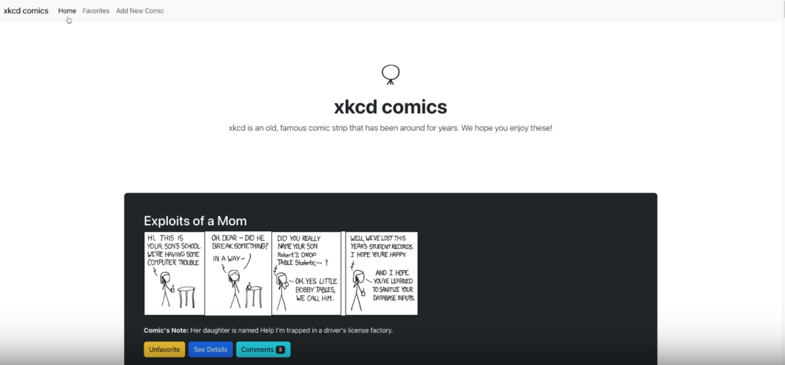

# XKCD Comics 
## About The Project

Front end application that enables users to explore a diverse collection of 20+ comics

 

### Loom video of XKCD Comics: 
https://www.loom.com/share/02d2f635d6a949acb0fd7417345c3502

<p align="right">(<a href="#readme-top">back to top</a>)</p>

## Built With
* React 
* JavaScript 
* JSON Local File 
* Bootstrap  


<p align="right">(<a href="#readme-top">back to top</a>)</p>


## Getting Started

Clone the repo
   ```sh
   git clone https://github.com/github_username/repo_name.git
   ```

## Back End Setup 

Cd into comic-app, install the dependencies, and start the server 
```console
$ cd comic-app 
$ npm install 
$ npm install -g json-server
$ npm run server 
```

## Front End Setup

While the back end terminal is running start a new terminal for the front end. 

Cd into comic-app and start the server 

```console
$ cd comic-app 
$ npm start 
```


## Authors 

* Wendy Yeung: https://github.com/wendy174
* Ann Ferracane: https://github.com/annferracane


## Contributing

Contributions are what make the open source community such an amazing place to learn, inspire, and create. Any contributions you make are **greatly appreciated**.

If you have a suggestion that would make this better, please fork the repo and create a pull request. You can also simply open an issue with the tag "enhancement".
Don't forget to give the project a star! Thanks again!

1. Fork the Project
2. Create your Feature Branch (`git checkout -b feature/AmazingFeature`)
3. Commit your Changes (`git commit -m 'Add some AmazingFeature'`)
4. Push to the Branch (`git push origin feature/AmazingFeature`)
5. Open a Pull Request

<p align="right">(<a href="#readme-top">back to top</a>)</p>


